# openpifpaf_furniture
A plugin of OpenPifPaf for furniture pose detection and classification

#### Abstract

> Real-time Multi-Object Furniture Pose Detection and Classification
>
> We present a multi-object pose detection and classification method of home furniture in cluttered and occluded indoor environments.
> We generalize OpenPifPaf, a field-based method that jointly detects and forms spatio-temporal keypoint associations of a specific object, with the capacity of jointly performing detection and classification of multiple objects in a bottom-up, box-free and real-time manner. We demonstrate that our proposed method outperforms state-of-the-art furniture key-
point detection methods on two publicly available datasets (Keypoint-5 and Pascal3D+).
> We further implement a synthetic dataset to evaluate the performance when target objects have occluded viewpoints or limited resolutions. Results also show that our synthetic dataset boosts the performance of detecting real-world instances. All source codes are shared.

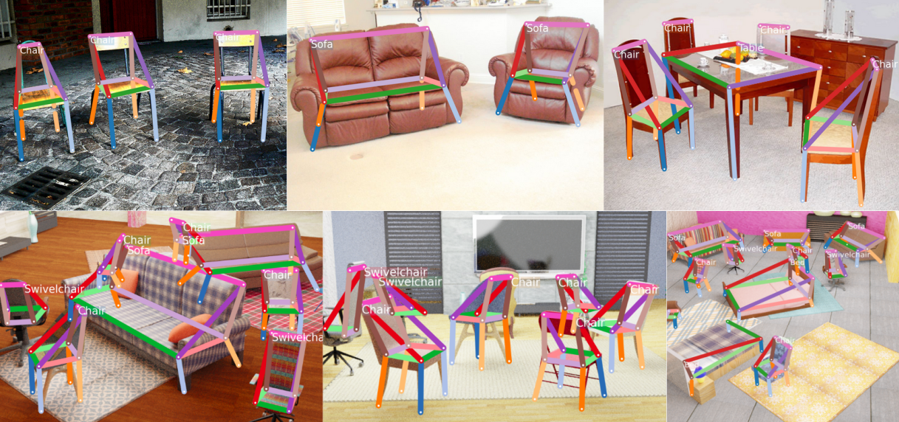

### Table of Contents

- [Installation](#installation)
- [Dataset](#dataset)
- [Pretrained models](#pretrained-models)
- [Interfaces](#interfaces)
- [Training](#training)
- [Prediction](#prediction)
- [Video](#video)
- [Evaluation](#evaluation)
- [Project structure](#project-structure)

## Installation

We encourage to setup a virtual environment in your work space.
```
# Create a virtual environment in work_space.
mkdir work_space
cd ws_space
virtualenv -p /usr/bin/python3.6 venv
source venv/bin/activate
```

Clone this repository in your work space.
```
# To clone the repository in work_space using HTTPS
git clone https://github.com/Mikasatlx/openpifpaf-furniture-detection.git
cd openpifpaf-furniture-detection
```

Dependencies can be found in the `requirements.txt` file.
```
# To install dependencies
pip3 install -r requirements.txt
```

The decoder is implemented as a C++ extension. Build it before using.
```
# To buile the C++ extension
pip3 install -e .
```

This OpenPifPaf plugin is equipped with additional capacity of object classification. The required keypoint labels are also in COCO format. If you want to train or evaluate a model on your local machine, unfortunately the coco.py in the pycocotool package which is automatically installed in the virtual environment can not support loading labels with different categories. Replace it with the one provided in this repository. 
(We only change the operator "&=" in line 195 to "|=" in order to support loading labels with different categories.)

```
cp coco.py ../venv/lib/python3.6/site-packages/pycocotools/
```

Note that this step is not necessary if you train or evaluate a model on the EPFL SCITAS cluster.

This project has been tested with Python 3.6, PyTorch 1.9.0, CUDA 10.2 and OpenPifPaf 0.13.0.


## Dataset

This project uses dataset [Keypoint5](http://3dinterpreter.csail.mit.edu/), [Pascal3D+](https://cvgl.stanford.edu/projects/pascal3d.html) and our proposed synthetic dataset for training and evaluation. Addtional work has been done to transfrom the original labels into the required COCO format, and combine them together in order to train a model for real-world applications (e.g., mobile furniture indoor localization). Download the [furniture dataset](https://figshare.com/s/8c312d037ba9a06aeec5) with COCO-style labels through this link, and put it in the openpifpaf-furniture-detection folder: 


## Pretrained models

Please download the [pretrained models](https://figshare.com/s/4872fecfcfca56c43713) from this link.

## Interfaces

This project is implemented as an [OpenPifPaf](https://github.com/openpifpaf/openpifpaf) plugin module.
As such, it benefits from all the core capabilities offered by OpenPifPaf, and only implements the additional functions it needs.

All the commands can be run through OpenPifPaf's interface using subparsers.
Help can be obtained for any of them with option `--help`.
More information can be found in [OpenPifPaf documentation](https://openpifpaf.github.io/intro.html).


## Training

Training is done using subparser `openpifpaf.train`.

Example of training on the furniture dataset can be run with the command:
```
python3 -m openpifpaf.train \
  --dataset furniture \
  --basenet shufflenetv2k30 \
  --furniture-train-annotations ./data-furniture/annotations/realuse_train.json \
  --furniture-val-annotation ./data-furniture/annotations/realuse_val.json \
  --furniture-train-image-dir ./data-furniture/images/train \
  --furniture-val-image-dir ./data-furniture/images/val \
  --furniture-square-edge 423 \
  --momentum 0.95 \
  --b-scale 3 \
  --clip-grad-value 5 \
  --epochs 150 \
  --lr-decay 130 140 \
  --lr-decay-epochs 10 \
  --lr-warm-up-epochs 10 \
  --weight-decay 1e-5 \
  --loader-workers 12 \
  --furniture-upsample 2 \
  --furniture-extended-scale \
  --furniture-orientation-invariant 0.1 \
  --batch-size 16
```
Arguments should be modified appropriately if needed.

More information about the options can be obtained with the command:
```
python3 -m openpifpaf.train --help
```

## Prediction

Result of a single image is predicted by using subparser `openpifpaf.predict`.

Example of predicting a image using the given checkpoint can be run with the command:

```
python3 -m openpifpaf.predict docs/test_images/pascal3d/demo2.jpg \
  --checkpoint ./outputs_furniture/shufflenetv2k30-220413-065600-furniture-slurm934377.pkl.epoch149 \
  -o docs/test_images_result/demo \
  --force-complete-pose-furniture \ 
  --instance-threshold-furniture 0.15 \
  --seed-threshold-furniture 0.2 \
  --line-width 8 \
  --font-size 0 
```

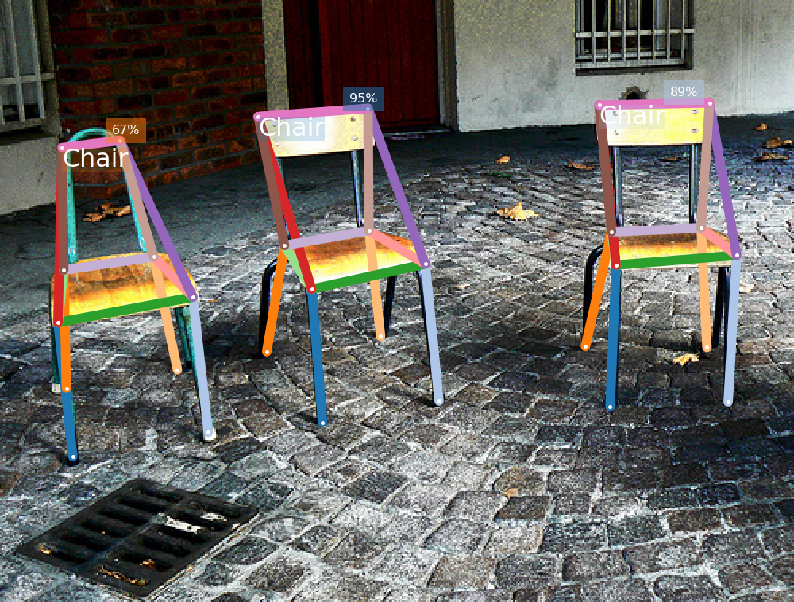

Arguments should be modified appropriately if needed.

To visualize all the composite fields of the 5th keypoint, add the following parameters in the command above:

```
--debug-indices cif:5 caf:5 cif_furniture:5 caf_furniture:5 
--save-all docs/test_images_result/debug_example
```

Keypoint confidence:
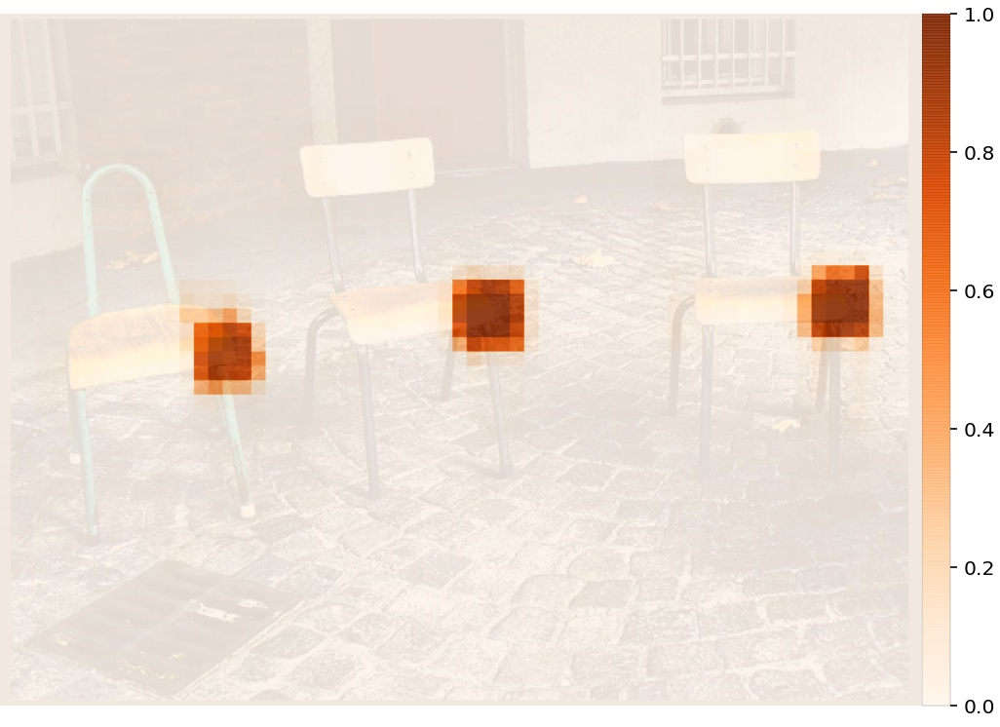

Keypoint classification (channel of bed category):
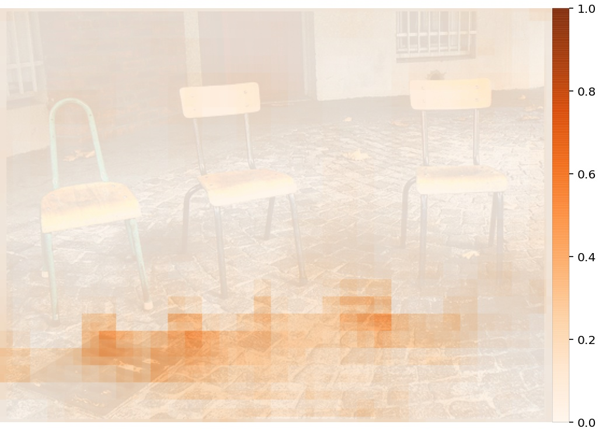

Keypoint classification (channel of chair category):
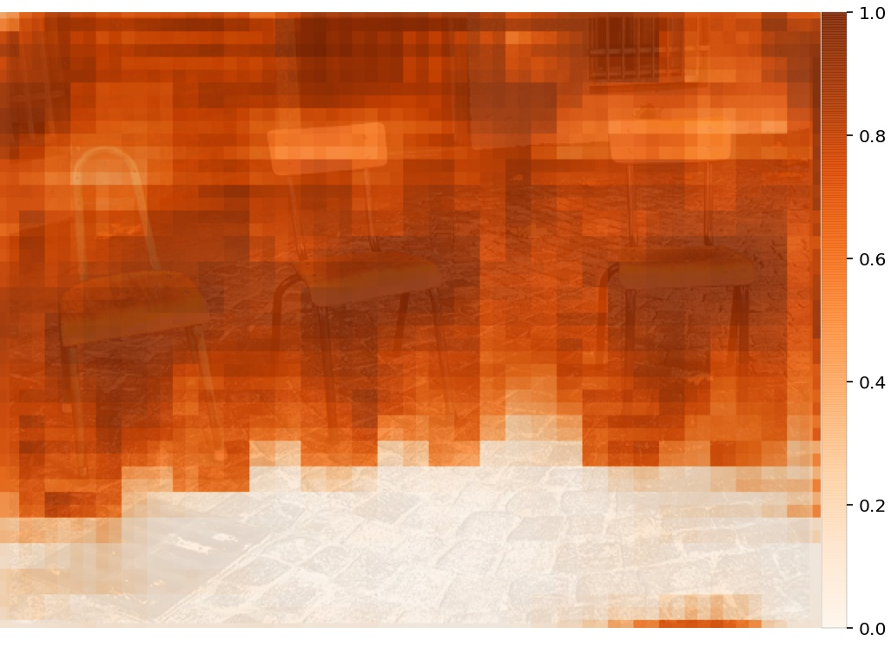

Keypoint regression:
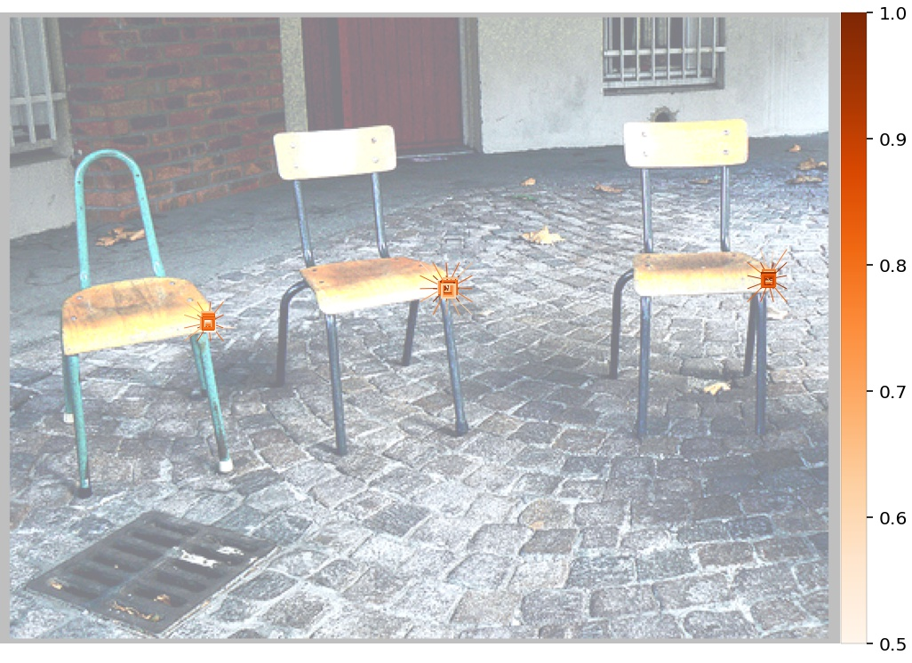

Keypoint high resolution map:
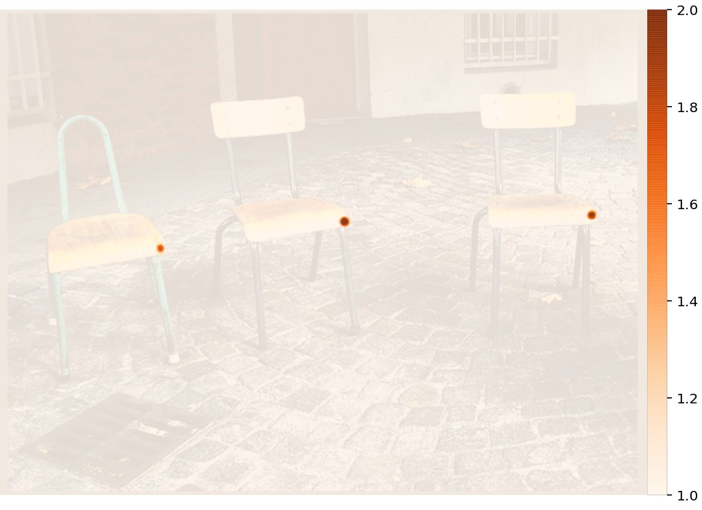

Association confidence:
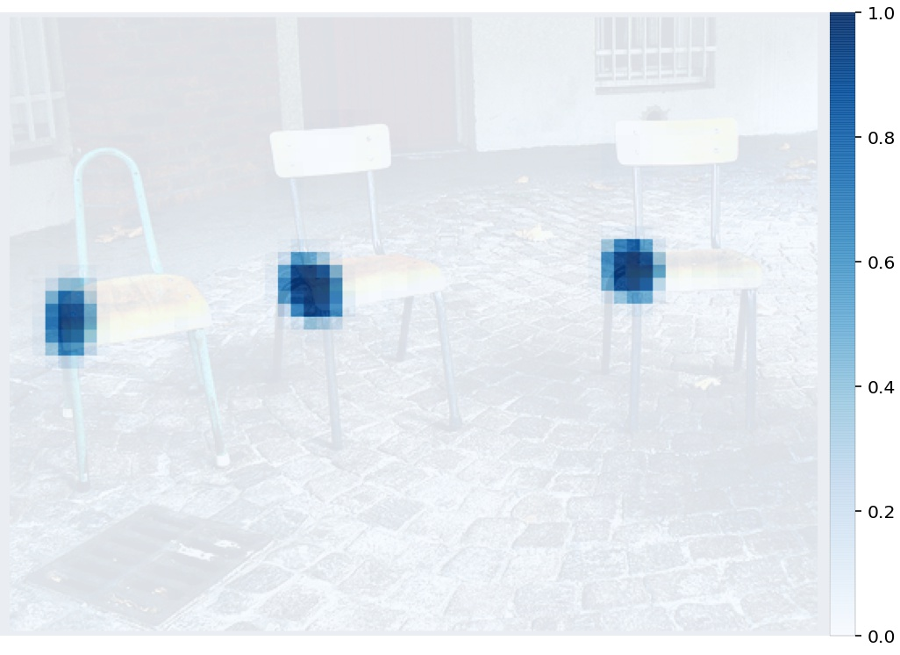

Association classification (channel of bed category):
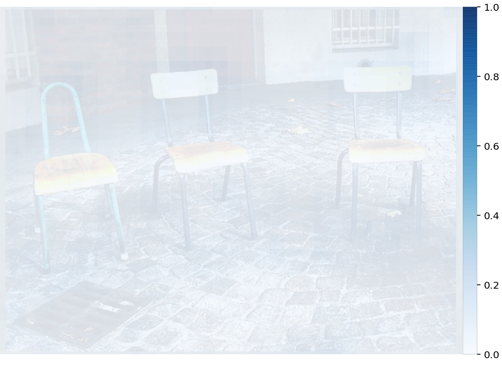

Association classification (channel of chair category):
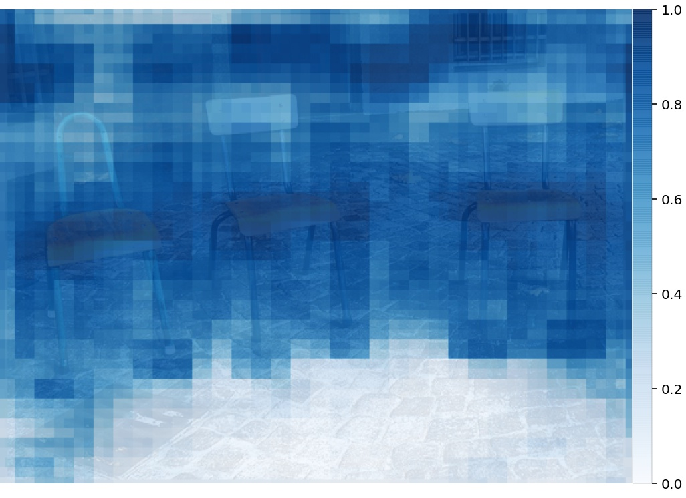

Association regression:
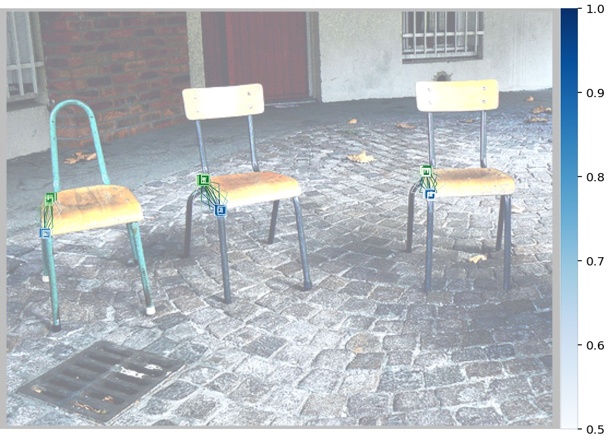

More information about the options can be obtained with the command:
```
python3 -m openpifpaf.predict --help
```

## Video

Result of video stream is predicted by using subparser `openpifpaf.video`.

Example of inferencing video stream using the given checkpoint can be run with the command:

```
python3 -m openpifpaf.video \
  --source ./docs/test_videos/v1.mp4 \
  --checkpoint ./outputs_furniture/shufflenetv2k30-220413-065600-furniture-slurm934377.pkl.epoch149 \
  --force-complete-pose-furniture \
  --instance-threshold-furniture 0.4 \
  --seed-threshold-furniture 0.05 \
  --video-output \
  --json-output \
  --video-fps 15
```

## Evaluation

A checkpoint is evaluated by using subparser `openpifpaf.eval`.

Example of evaluating the given checkpoint can be run with the command:
     
```
CUDA_VISIBLE_DEVICES=0 python3 -m openpifpaf.eval \
  --dataset furniture \
  --checkpoint ./outputs_furniture/shufflenetv2k30-220413-065600-furniture-slurm934377.pkl.epoch149 \
  --loader-workers=12 \
  --force-complete-pose-furniture \
  --instance-threshold-furniture 0.15 \
  --seed-threshold-furniture 0.2 \
  --furniture-eval-long-edge 0 
```
Arguments should be modified appropriately if needed.


More information about the options can be obtained with the command:
```
python3 -m openpifpaf.eval --help
```


## Project structure
```
openpifpaf_furniture_detection/
├── openpifpaf_furniture/
│   ├── csrc/
│   ├── decoder/
│   ├── encoder/
│   ├── furniture/
│   ├── network/
│   ├── show/
│   ├── visualizer/
│   ├── annotation.py
│   ├── cpp_extension.py
│   ├── headmeta.py
│   └── __init__.py
├── docs/
│   ├── test_images/
│   ├── test_images_result/
│   ├── test_videos/
│   └── (add other test examples here)
├── data-furniture/
│   ├── annotations/ 
│   └── images/
│       ├── train/
│       └── val/
│       └── test/
└── outputs/
    └── (add pretrained models here)
```
